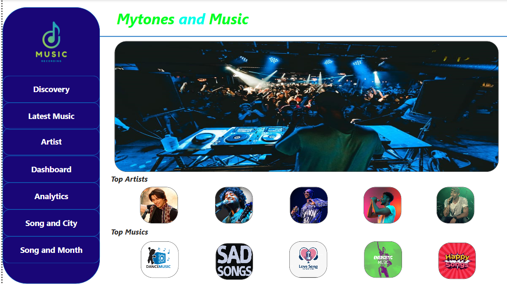
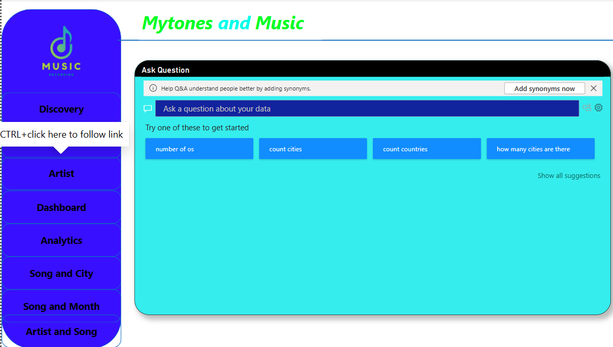
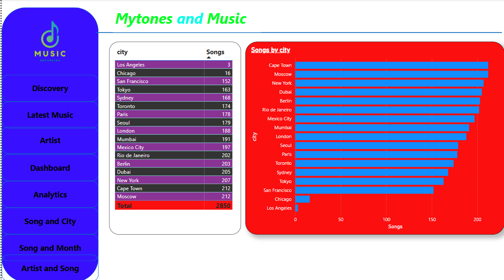

# 🎵 Data Warehouse Project: Musical Dataset 🎵  

This project presents a **data warehouse** implementation for a **musical dataset**, showcasing multiple **interactive plots and graphs** such as:  
📈 **Line Graphs** | 📊 **Bar Charts** | 🥧 **Pie Charts**  

The dataset is structured using the **Star Schema**, making it efficient for analytical queries.  

---

## 📂 Project Overview  

- **Dataset Details:**  
  - Contains **8 columns**:  
    - 🏆 **Album**  
    - 🎤 **Artist**  
    - 📱 **Device**  
    - 🎼 **Genre**  
    - 📍 **Location**  
    - 🎵 **Song**  
    - ▶️ **SongPlay**  
    - 👤 **User**  
  - **Dataset Size:** Small, self-created dataset.  

- **Data Warehouse Concept:**  
  - Implemented using **Star Schema** for optimized query performance.  

- **Visualization Tools:**  
  - Multiple pages with **rich graphical representations** of the dataset.  

---

### Sample 1 
  

### Sample 2  
  

### Sample 3

